# Hi there 👋, I'm lighterEB

> Every adiós is a semicolon, not an end.

  
  **Java Developer & Aspiring Software Architect**  
  🇨🇳 Based in Changsha, China | 🌐 [lightereb.fun](http://lightereb.fun)

   

  I'm a passionate engineer transitioning from **Java Enterprise** development to **System Programming**.  
  While I have a strong background in the **Spring Ecosystem** and **Microservices**, I am actively expanding my horizons with **Rust**, **Go**, and **Zig**.  
  I love building practical tools that solve real-world problems and optimize workflows.

  <h3>💻 Tech Stack & Arsenal</h3>

<!-- 1. Languages -->

  
  
  
  
  
  

<!-- 2. Backend & Middleware (Architecture) -->

   
  
  
  
  
  
  

<!-- 3. Frontend & Tools -->

   
  
  
  
  
  

<!-- 4. OS -->

   
  
  
  

 

<!-- 📊 GitHub Metrics (Local Files via Actions) -->
<table border="0" width="100%">
  <tr>
    <td width="50%" valign="top">
      
    </td>
    <td width="50%" valign="top">
      
    </td>
  </tr>
</table>

### 🚀 Featured Projects
- 🔽 [SoftwareDownloader](https://github.com/lighterEB/SoftwareDownloader) - Pure software downloader (Python)
- 🍎 [ThinkPad-T440p](https://github.com/lighterEB/ThinkPad-T440p) - Hackintosh config for ThinkPad T440p

### 🐍 Contributions
<picture>
  <source media="(prefers-color-scheme: dark)" srcset="https://raw.githubusercontent.com/lighterEB/lighterEB/output/github-contribution-grid-snake-dark.svg">
  <source media="(prefers-color-scheme: light)" srcset="https://raw.githubusercontent.com/lighterEB/lighterEB/output/github-contribution-grid-snake.svg">
  
</picture>

   
  
  ### 📫 Connect with Me
  
  
  

